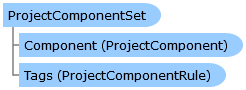

       

 Collapse All Expand All  Language Filter: All  Language Filter: Multiple  Language Filter: Visual Basic (Declaration) Language Filter: Visual Basic (Usage) Language Filter: C#  
---  
DriveWorks SDK Documentation  |   
---|---  
ProjectComponentSet Class   
[Members](topic4107.md) See Also [Send Feedback](mailto:apisupport@driveworks.co.uk?subject=Documentation Feedback: topic4106.md)  
[DriveWorks.Engine Assembly](topic2156.md) > [DriveWorks Namespace](topic2159.md) : ProjectComponentSet Class  
---  
  
Visual Basic (Declaration)    
Visual Basic (Usage)    
C# 

Glossary Item Box

Provides access to a component set which contains the rules for a complete hierarchy of components. 

# Object Model

# Syntax

Visual Basic (Declaration)|   
---|---  
      
    
    <DebuggerDisplayAttribute(Value="Name = {Name}", 
       Name="", 
       Type="", 
       Target=, 
       TargetTypeName="")>
    Public NotInheritable Class ProjectComponentSet 
       Inherits DomainObject  
  
Visual Basic (Usage)| Copy Code  
---|---  
      
    
    Dim instance As [ProjectComponentSet](topic4106.md)  
  
C#|   
---|---  
      
    
    [DebuggerDisplayAttribute(Value="Name = {Name}", 
       Name="", 
       Type="", 
       Target=, 
       TargetTypeName="")]
    public sealed class ProjectComponentSet : DomainObject   
  
# Inheritance Hierarchy

System.Object  
System.MarshalByRefObject  
**DriveWorks.ProjectComponentSet**  

# Requirements

**Target Platforms:** Please see DriveWorks software prerequisites.

# See Also

#### Reference

[ProjectComponentSet Members](topic4107.md)   
[DriveWorks Namespace](topic2159.md)

©2024 DriveWorks Ltd. All Rights Reserved.
