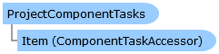

Collapse All Expand All Language Filter: All  Language Filter: Multiple  Language Filter: Visual Basic (Declaration) Language Filter: Visual Basic (Usage) Language Filter: C#  
---  
DriveWorks SDK Documentation  |   
---|---  
ProjectComponentTasks Class   
[Members](topic4164.md)   
[DriveWorks.Engine Assembly](topic2156.md) > [DriveWorks Namespace](topic2159.md) : ProjectComponentTasks Class  
---  
  
Visual Basic (Declaration)    
Visual Basic (Usage)    
C# 

Glossary Item Box

Represents collections of [DriveWorks.Components.Tasks.ComponentTask](topic6407.md)s that aren't tied to specific components. 

# Object Model

# Syntax

Visual Basic (Declaration)|   
---|---  
      
    
    <DefaultMemberAttribute("Item")>
    Public Class ProjectComponentTasks   
  
Visual Basic (Usage)| Copy Code  
---|---  
      
    
    Dim instance As [ProjectComponentTasks](topic4163.md)  
  
C#|   
---|---  
      
    
    [DefaultMemberAttribute("Item")]
    public class ProjectComponentTasks   
  
# Inheritance Hierarchy

System.Object  
**DriveWorks.ProjectComponentTasks**  

# Requirements

**Target Platforms:** Please see DriveWorks software prerequisites.

# See Also

#### Reference

[ProjectComponentTasks Members](topic4164.md)   
[DriveWorks Namespace](topic2159.md)

