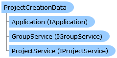

Collapse All Expand All Language Filter: All  Language Filter: Multiple  Language Filter: Visual Basic (Declaration) Language Filter: Visual Basic (Usage) Language Filter: C#  
---  
DriveWorks SDK Documentation  |   
---|---  
ProjectCreationData Class   
[Members](topic2133.md)   
[DriveWorks.Applications Assembly](topic13.md) > [DriveWorks.Applications.Extensibility Namespace](topic1995.md) : ProjectCreationData Class  
---  
  
Visual Basic (Declaration)    
Visual Basic (Usage)    
C# 

Glossary Item Box

Provides information about a project to be created. 

# Object Model

# Syntax

Visual Basic (Declaration)|   
---|---  
      
    
    Public Class ProjectCreationData   
  
Visual Basic (Usage)| Copy Code  
---|---  
      
    
    Dim instance As [ProjectCreationData](topic2132.md)  
  
C#|   
---|---  
      
    
    public class ProjectCreationData   
  
# Inheritance Hierarchy

System.Object  
**DriveWorks.Applications.Extensibility.ProjectCreationData**  

# Requirements

**Target Platforms:** Please see DriveWorks software prerequisites.

# See Also

#### Reference

[ProjectCreationData Members](topic2133.md)   
[DriveWorks.Applications.Extensibility Namespace](topic1995.md)

