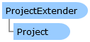

Collapse All Expand All Language Filter: All  Language Filter: Multiple  Language Filter: Visual Basic (Declaration) Language Filter: Visual Basic (Usage) Language Filter: C#  
---  
DriveWorks SDK Documentation  |   
---|---  
ProjectExtender Class   
[Members](topic7233.md) Example   
[DriveWorks.Engine Assembly](topic2156.md) > [DriveWorks.Extensibility Namespace](topic7150.md) : ProjectExtender Class  
---  
  
Visual Basic (Declaration)    
Visual Basic (Usage)    
C# 

Glossary Item Box

Provides support for extending a project. 

# Object Model

# Syntax

Visual Basic (Declaration)|   
---|---  
      
    
    Public MustInherit Class ProjectExtender 
       Inherits DriveWorks.DomainObject  
  
Visual Basic (Usage)| Copy Code  
---|---  
      
    
    Dim instance As [ProjectExtender](topic7232.md)  
  
C#|   
---|---  
      
    
    public abstract class ProjectExtender : DriveWorks.DomainObject   
  
# Example

Visual Basic| Copy Code  
---|---  
      
    
    Imports DriveWorks
    Imports DriveWorks.Extensibility
     
    Public Class MyExtender
       Inherits ProjectExtender
     
       ' The UDF attribute lets DriveWorks know that this
       ' is a user defined function that can be called
       ' from a DriveWorks project (Excel projects do not support this feature).
       ' The valid types that can be taken/returned by a UDF are
       ' String
       ' Double
       ' DateTime
       ' Boolean
       ' Object - the value passed to an object typed parameter will always be
       ' one of the above, and the value returned by an object typed
       ' method must always be one of the above.
       <Udf()> _
       Public Function MyUdf(ByVal value1 As Double, ByVal value2 As Double) As Double
           Return value1 * value2
       End Function
     
       ' The macro attribute lets DriveWorks
       ' know that this is a macro that can
       ' be called from a macro button or by using
       ' the RunDesignMasterMacro specification flow
       ' task
       <Macro()> _
       Public Sub MyMacro()
           ' You can work with the project in this macro
           ' by accessing Me.Project
       End Sub
    End Class  
  
# Inheritance Hierarchy

System.Object  
System.MarshalByRefObject  
**DriveWorks.Extensibility.ProjectExtender**  

# Requirements

**Target Platforms:** Please see DriveWorks software prerequisites.

# See Also

#### Reference

[ProjectExtender Members](topic7233.md)   
[DriveWorks.Extensibility Namespace](topic7150.md)

