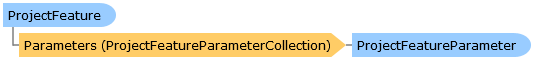

Collapse All Expand All Language Filter: All  Language Filter: Multiple  Language Filter: Visual Basic (Declaration) Language Filter: Visual Basic (Usage) Language Filter: C#  
---  
DriveWorks SDK Documentation  |   
---|---  
ProjectFeature Class   
[Members](topic14533.md)   
[DriveWorks.SolidWorks Assembly](topic13342.md) > [DriveWorks.SolidWorks.Components Namespace](topic13925.md) : ProjectFeature Class  
---  
  
Visual Basic (Declaration)    
Visual Basic (Usage)    
C# 

Glossary Item Box

Represents a captured feature on a component that has been added to a project. 

# Object Model

# Syntax

Visual Basic (Declaration)|   
---|---  
      
    
    Public Class ProjectFeature 
       Implements [DriveWorks.Abstractions.IHasRule](topic5947.md), [DriveWorks.Abstractions.IHasRuleType](topic5969.md), [DriveWorks.Abstractions.IHasRuleVersionHistory](topic5975.md), [DriveWorks.Abstractions.INotifyRuleChanged](topic5987.md)   
  
Visual Basic (Usage)| Copy Code  
---|---  
      
    
    Dim instance As [ProjectFeature](topic14532.md)  
  
C#|   
---|---  
      
    
    public class ProjectFeature : [DriveWorks.Abstractions.IHasRule](topic5947.md), [DriveWorks.Abstractions.IHasRuleType](topic5969.md), [DriveWorks.Abstractions.IHasRuleVersionHistory](topic5975.md), [DriveWorks.Abstractions.INotifyRuleChanged](topic5987.md)    
  
# Inheritance Hierarchy

System.Object  
**DriveWorks.SolidWorks.Components.ProjectFeature**  

# Requirements

**Target Platforms:** Please see DriveWorks software prerequisites.

# See Also

#### Reference

[ProjectFeature Members](topic14533.md)   
[DriveWorks.SolidWorks.Components Namespace](topic13925.md)

