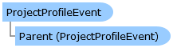

       

 Collapse All Expand All  Language Filter: All  Language Filter: Multiple  Language Filter: Visual Basic (Declaration) Language Filter: Visual Basic (Usage) Language Filter: C#  
---  
DriveWorks SDK Documentation  |   
---|---  
ProjectProfileEvent Class   
[Members](topic4682.md)   
[DriveWorks.Engine Assembly](topic2156.md) > [DriveWorks Namespace](topic2159.md) : ProjectProfileEvent Class  
---  
  
Visual Basic (Declaration)    
Visual Basic (Usage)    
C# 

Glossary Item Box

Represents a logical event scope used to track processes in profiling. 

# Object Model

# Syntax

Visual Basic (Declaration)|   
---|---  
      
    
    Public Class ProjectProfileEvent 
       Inherits [ProjectProfileEventBase](topic4702.md)  
  
Visual Basic (Usage)| Copy Code  
---|---  
      
    
    Dim instance As [ProjectProfileEvent](topic4681.md)  
  
C#|   
---|---  
      
    
    public class ProjectProfileEvent : [ProjectProfileEventBase](topic4702.md)   
  
# Inheritance Hierarchy

System.Object  
System.MarshalByRefObject  
[DriveWorks.ProjectProfileEventBase](topic4702.md)  
**DriveWorks.ProjectProfileEvent**  

# Requirements

**Target Platforms:** Please see DriveWorks software prerequisites.

# See Also

#### Reference

[ProjectProfileEvent Members](topic4682.md)   
[DriveWorks Namespace](topic2159.md)

