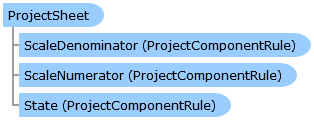

       

 Collapse All Expand All  Language Filter: All  Language Filter: Multiple  Language Filter: Visual Basic (Declaration) Language Filter: Visual Basic (Usage) Language Filter: C#  
---  
DriveWorks SDK Documentation  |   
---|---  
ProjectSheet Class   
[Members](topic14674.md)   
[DriveWorks.SolidWorks Assembly](topic13342.md) > [DriveWorks.SolidWorks.Components Namespace](topic13925.md) : ProjectSheet Class  
---  
  
Visual Basic (Declaration)    
Visual Basic (Usage)    
C# 

Glossary Item Box

Represents a captured sheet on a drawing that has been added to a project. 

# Object Model

# Syntax

Visual Basic (Declaration)|   
---|---  
      
    
    Public Class ProjectSheet   
  
Visual Basic (Usage)| Copy Code  
---|---  
      
    
    Dim instance As [ProjectSheet](topic14673.md)  
  
C#|   
---|---  
      
    
    public class ProjectSheet   
  
# Inheritance Hierarchy

System.Object  
**DriveWorks.SolidWorks.Components.ProjectSheet**  

# Requirements

**Target Platforms:** Please see DriveWorks software prerequisites.

# See Also

#### Reference

[ProjectSheet Members](topic14674.md)   
[DriveWorks.SolidWorks.Components Namespace](topic13925.md)

