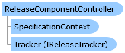

ReleaseComponentController Class   
[Members](topic6253.md)   
[DriveWorks.Engine Assembly](topic2156.md) > [DriveWorks.Components Namespace](topic6089.md) : ReleaseComponentController Class  
---  
  
Visual Basic (Declaration)    
Visual Basic (Usage)    
C# 

Glossary Item Box

Provided to a component during its release to give it the opportunity to control certain aspects of its release process. 

# Object Model

# Syntax

Visual Basic (Declaration)|   
---|---  
      
    
    Public NotInheritable Class ReleaseComponentController 
       Inherits DriveWorks.DomainObject  
  
Visual Basic (Usage)| Copy Code  
---|---  
      
    
    Dim instance As [ReleaseComponentController](topic6252.md)  
  
C#|   
---|---  
      
    
    public sealed class ReleaseComponentController : DriveWorks.DomainObject   
  
# Inheritance Hierarchy

System.Object  
System.MarshalByRefObject  
**DriveWorks.Components.ReleaseComponentController**  

# Requirements

**Target Platforms:** Please see DriveWorks software prerequisites.

# See Also

#### Reference

[ReleaseComponentController Members](topic6253.md)   
[DriveWorks.Components Namespace](topic6089.md)

