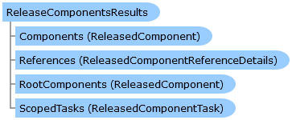

       

 Collapse All Expand All  Language Filter: All  Language Filter: Multiple  Language Filter: Visual Basic (Declaration) Language Filter: Visual Basic (Usage) Language Filter: C#  
---  
DriveWorks SDK Documentation  |   
---|---  
ReleaseComponentsResults Class   
[Members](topic6301.md) See Also [Send Feedback](mailto:apisupport@driveworks.co.uk?subject=Documentation Feedback: topic6300.md)  
[DriveWorks.Engine Assembly](topic2156.md) > [DriveWorks.Components Namespace](topic6089.md) : ReleaseComponentsResults Class  
---  
  
Visual Basic (Declaration)    
Visual Basic (Usage)    
C# 

Glossary Item Box

Encapsulates the results of releasing one or more component sets. 

# Object Model

# Syntax

Visual Basic (Declaration)|   
---|---  
      
    
    Public NotInheritable Class ReleaseComponentsResults   
  
Visual Basic (Usage)| Copy Code  
---|---  
      
    
    Dim instance As [ReleaseComponentsResults](topic6300.md)  
  
C#|   
---|---  
      
    
    public sealed class ReleaseComponentsResults   
  
# Inheritance Hierarchy

System.Object  
**DriveWorks.Components.ReleaseComponentsResults**  

# Requirements

**Target Platforms:** Please see DriveWorks software prerequisites.

# See Also

#### Reference

[ReleaseComponentsResults Members](topic6301.md)   
[DriveWorks.Components Namespace](topic6089.md)

©2024 DriveWorks Ltd. All Rights Reserved.
