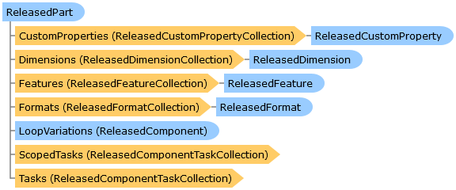

       

 Collapse All Expand All  Language Filter: All  Language Filter: Multiple  Language Filter: Visual Basic (Declaration) Language Filter: Visual Basic (Usage) Language Filter: C#  
---  
DriveWorks SDK Documentation  |   
---|---  
ReleasedPart Class   
[Members](topic14995.md) See Also [Send Feedback](mailto:apisupport@driveworks.co.uk?subject=Documentation Feedback: topic14994.md)  
[DriveWorks.SolidWorks Assembly](topic13342.md) > [DriveWorks.SolidWorks.Components Namespace](topic13925.md) : ReleasedPart Class  
---  
  
Visual Basic (Declaration)    
Visual Basic (Usage)    
C# 

Glossary Item Box

Represents a released SolidWorks part. 

# Object Model

# Syntax

Visual Basic (Declaration)|   
---|---  
      
    
    <[ComponentFactoryAttribute](topic6167.md)(DriveWorks.SolidWorks.Components.PartFactory)>
    Public Class ReleasedPart 
       Inherits [ReleasedModel](topic14988.md)
       Implements [IHasReleasedCustomProperties](topic14005.md), [IHasReleasedDimensions](topic14011.md), [IHasReleasedFeatures](topic14017.md), [IHasReleasedFormats](topic14023.md)   
  
Visual Basic (Usage)| Copy Code  
---|---  
      
    
    Dim instance As [ReleasedPart](topic14994.md)  
  
C#|   
---|---  
      
    
    [[ComponentFactoryAttribute](topic6167.md)(DriveWorks.SolidWorks.Components.PartFactory)]
    public class ReleasedPart : [ReleasedModel](topic14988.md), [IHasReleasedCustomProperties](topic14005.md), [IHasReleasedDimensions](topic14011.md), [IHasReleasedFeatures](topic14017.md), [IHasReleasedFormats](topic14023.md)    
  
# Inheritance Hierarchy

System.Object  
System.MarshalByRefObject  
[DriveWorks.Components.ReleasedComponent](topic6324.md)  
[DriveWorks.SolidWorks.Components.ReleasedSolidWorksComponent](topic15029.md)  
[DriveWorks.SolidWorks.Components.ReleasedModel](topic14988.md)  
**DriveWorks.SolidWorks.Components.ReleasedPart**  

# Requirements

**Target Platforms:** Please see DriveWorks software prerequisites.

# See Also

#### Reference

[ReleasedPart Members](topic14995.md)   
[DriveWorks.SolidWorks.Components Namespace](topic13925.md)

©2024 DriveWorks Ltd. All Rights Reserved.
