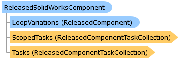

       

 Collapse All Expand All  Language Filter: All  Language Filter: Multiple  Language Filter: Visual Basic (Declaration) Language Filter: Visual Basic (Usage) Language Filter: C#  
---  
DriveWorks SDK Documentation  |   
---|---  
ReleasedSolidWorksComponent Class   
[Members](topic15030.md)   
[DriveWorks.SolidWorks Assembly](topic13342.md) > [DriveWorks.SolidWorks.Components Namespace](topic13925.md) : ReleasedSolidWorksComponent Class  
---  
  
Visual Basic (Declaration)    
Visual Basic (Usage)    
C# 

Glossary Item Box

The base class for released SolidWorks components. 

# Object Model

# Syntax

Visual Basic (Declaration)|   
---|---  
      
    
    <DebuggerDisplayAttribute(Value="{TargetPath}", 
       Name="", 
       Type="", 
       Target=, 
       TargetTypeName="")>
    Public MustInherit Class ReleasedSolidWorksComponent 
       Inherits [DriveWorks.Components.ReleasedComponent](topic6324.md)  
  
Visual Basic (Usage)| Copy Code  
---|---  
      
    
    Dim instance As [ReleasedSolidWorksComponent](topic15029.md)  
  
C#|   
---|---  
      
    
    [DebuggerDisplayAttribute(Value="{TargetPath}", 
       Name="", 
       Type="", 
       Target=, 
       TargetTypeName="")]
    public abstract class ReleasedSolidWorksComponent : [DriveWorks.Components.ReleasedComponent](topic6324.md)   
  
# Inheritance Hierarchy

System.Object  
System.MarshalByRefObject  
[DriveWorks.Components.ReleasedComponent](topic6324.md)  
**DriveWorks.SolidWorks.Components.ReleasedSolidWorksComponent**  
[DriveWorks.SolidWorks.Components.ReleasedDrawing](topic14859.md)  
[DriveWorks.SolidWorks.Components.ReleasedModel](topic14988.md)  

# Requirements

**Target Platforms:** Please see DriveWorks software prerequisites.

# See Also

#### Reference

[ReleasedSolidWorksComponent Members](topic15030.md)   
[DriveWorks.SolidWorks.Components Namespace](topic13925.md)

