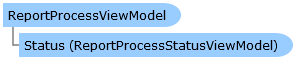

       

 Collapse All Expand All  Language Filter: All  Language Filter: Multiple  Language Filter: Visual Basic (Declaration) Language Filter: Visual Basic (Usage) Language Filter: C#  
---  
DriveWorks SDK Documentation  |   
---|---  
ReportProcessViewModel Class   
[Members](topic15391.md)   
[DriveWorks.SolidWorks Assembly](topic13342.md) > [DriveWorks.SolidWorks.Generation.Unified.UI.ReportViewer Namespace](topic15361.md) : ReportProcessViewModel Class  
---  
  
Visual Basic (Declaration)    
Visual Basic (Usage)    
C# 

Glossary Item Box

# Object Model

# Syntax

Visual Basic (Declaration)|   
---|---  
      
    
    Public Class ReportProcessViewModel 
       Inherits [ReportItemBase](topic15376.md)  
  
Visual Basic (Usage)| Copy Code  
---|---  
      
    
    Dim instance As [ReportProcessViewModel](topic15390.md)  
  
C#|   
---|---  
      
    
    public class ReportProcessViewModel : [ReportItemBase](topic15376.md)   
  
# Inheritance Hierarchy

System.Object  
[DriveWorks.SolidWorks.Generation.Unified.UI.ReportViewer.ReportItemBase](topic15376.md)  
**DriveWorks.SolidWorks.Generation.Unified.UI.ReportViewer.ReportProcessViewModel**  

# Requirements

**Target Platforms:** Please see DriveWorks software prerequisites.

# See Also

#### Reference

[ReportProcessViewModel Members](topic15391.md)   
[DriveWorks.SolidWorks.Generation.Unified.UI.ReportViewer Namespace](topic15361.md)

