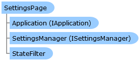

       

 Collapse All Expand All  Language Filter: All  Language Filter: Multiple  Language Filter: Visual Basic (Declaration) Language Filter: Visual Basic (Usage) Language Filter: C#  
---  
DriveWorks SDK Documentation  |   
---|---  
SettingsPage Class   
[Members](topic936.md)   
[DriveWorks.Applications Assembly](topic13.md) > [DriveWorks.Applications Namespace](topic16.md) : SettingsPage Class  
---  
  
Visual Basic (Declaration)    
Visual Basic (Usage)    
C# 

Glossary Item Box

Provides the base class for settings pages. 

# Object Model

# Syntax

Visual Basic (Declaration)|   
---|---  
      
    
    Public Class SettingsPage 
       Inherits System.Windows.Forms.UserControl  
  
Visual Basic (Usage)| Copy Code  
---|---  
      
    
    Dim instance As [SettingsPage](topic935.md)  
  
C#|   
---|---  
      
    
    public class SettingsPage : System.Windows.Forms.UserControl   
  
# Inheritance Hierarchy

System.Object  
System.MarshalByRefObject  
System.ComponentModel.Component  
System.Windows.Forms.Control  
System.Windows.Forms.ScrollableControl  
System.Windows.Forms.ContainerControl  
System.Windows.Forms.UserControl  
**DriveWorks.Applications.SettingsPage**  

# Requirements

**Target Platforms:** Please see DriveWorks software prerequisites.

# See Also

#### Reference

[SettingsPage Members](topic936.md)   
[DriveWorks.Applications Namespace](topic16.md)

