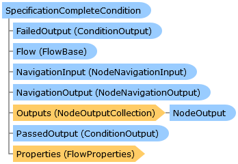

SpecificationCompleteCondition Class   
[Members](topic11884.md)   
[DriveWorks.Engine Assembly](topic2156.md) > [DriveWorks.Specification.StandardConditions Namespace](topic11828.md) : SpecificationCompleteCondition Class  
---  
  
Visual Basic (Declaration)    
Visual Basic (Usage)    
C# 

Glossary Item Box

A specification-flow condition which checks whether a running specification is complete. 

# Object Model

# Syntax

Visual Basic (Declaration)|   
---|---  
      
    
    <[ConditionAttribute](topic10832.md)(DisplayName="resx://DriveWorks.ConditionsLocalizedResources,ConditionDispNameSpecificationCompleteCondition", 
       Image="embedded://DriveWorks.SpecificationCompleteConditionPlain16.png", 
       WarningOutputEnabled=True)>
    Public Class SpecificationCompleteCondition 
       Inherits [DriveWorks.Specification.Condition](topic10804.md)
       Implements [DriveWorks.EventFlow.IFlowNode](topic6873.md), [DriveWorks.Extensibility.IExtension](topic7152.md)   
  
Visual Basic (Usage)| Copy Code  
---|---  
      
    
    Dim instance As [SpecificationCompleteCondition](topic11883.md)  
  
C#|   
---|---  
      
    
    [[ConditionAttribute](topic10832.md)(DisplayName="resx://DriveWorks.ConditionsLocalizedResources,ConditionDispNameSpecificationCompleteCondition", 
       Image="embedded://DriveWorks.SpecificationCompleteConditionPlain16.png", 
       WarningOutputEnabled=true)]
    public class SpecificationCompleteCondition : [DriveWorks.Specification.Condition](topic10804.md), [DriveWorks.EventFlow.IFlowNode](topic6873.md), [DriveWorks.Extensibility.IExtension](topic7152.md)    
  
# Inheritance Hierarchy

System.Object  
System.MarshalByRefObject  
[DriveWorks.EventFlow.ExecutableNodeBase](topic6938.md)  
[DriveWorks.Specification.Condition](topic10804.md)  
**DriveWorks.Specification.StandardConditions.SpecificationCompleteCondition**  

# Requirements

**Target Platforms:** Please see DriveWorks software prerequisites.

# See Also

#### Reference

[SpecificationCompleteCondition Members](topic11884.md)   
[DriveWorks.Specification.StandardConditions Namespace](topic11828.md)

