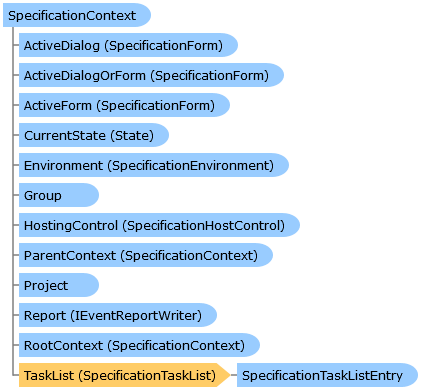

       

 Collapse All Expand All  Language Filter: All  Language Filter: Multiple  Language Filter: Visual Basic (Declaration) Language Filter: Visual Basic (Usage) Language Filter: C#  
---  
DriveWorks SDK Documentation  |   
---|---  
SpecificationContext Class   
[Members](topic11150.md)   
[DriveWorks.Engine Assembly](topic2156.md) > [DriveWorks.Specification Namespace](topic10764.md) : SpecificationContext Class  
---  
  
Visual Basic (Declaration)    
Visual Basic (Usage)    
C# 

Glossary Item Box

Provides contextual information to a running specification-flow. 

# Object Model

# Syntax

Visual Basic (Declaration)|   
---|---  
      
    
    Public Class SpecificationContext 
       Inherits DriveWorks.DomainObject  
  
Visual Basic (Usage)| Copy Code  
---|---  
      
    
    Dim instance As [SpecificationContext](topic11149.md)  
  
C#|   
---|---  
      
    
    public class SpecificationContext : DriveWorks.DomainObject   
  
# Remarks

This class can be overridden by a hosting environment to gain more control over the specification process.

A specification-flow context can be in one of a number of states:

Term | Description  
---|---  
Not Loaded/Unloaded | The specification context has been newly created and no specification has been loaded into it.  
Loaded/Stopped | The specification context has a specification loaded into it, but the specification is not in a running state.  
Running | The specification context has a specification loaded which is in a running state.  
  
# Inheritance Hierarchy

System.Object  
System.MarshalByRefObject  
**DriveWorks.Specification.SpecificationContext**  

# Requirements

**Target Platforms:** Please see DriveWorks software prerequisites.

# See Also

#### Reference

[SpecificationContext Members](topic11150.md)   
[DriveWorks.Specification Namespace](topic10764.md)

