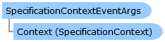

       

 Collapse All Expand All  Language Filter: All  Language Filter: Multiple  Language Filter: Visual Basic (Declaration) Language Filter: Visual Basic (Usage) Language Filter: C#  
---  
DriveWorks SDK Documentation  |   
---|---  
SpecificationContextEventArgs Class   
[Members](topic11285.md) See Also [Send Feedback](mailto:apisupport@driveworks.co.uk?subject=Documentation Feedback: topic11284.md)  
[DriveWorks.Engine Assembly](topic2156.md) > [DriveWorks.Specification Namespace](topic10764.md) : SpecificationContextEventArgs Class  
---  
  
Visual Basic (Declaration)    
Visual Basic (Usage)    
C# 

Glossary Item Box

Provides event data for events involving a specification context. 

# Object Model

# Syntax

Visual Basic (Declaration)|   
---|---  
      
    
    Public Class SpecificationContextEventArgs 
       Inherits System.EventArgs  
  
Visual Basic (Usage)| Copy Code  
---|---  
      
    
    Dim instance As [SpecificationContextEventArgs](topic11284.md)  
  
C#|   
---|---  
      
    
    public class SpecificationContextEventArgs : System.EventArgs   
  
# Inheritance Hierarchy

System.Object  
System.EventArgs  
**DriveWorks.Specification.SpecificationContextEventArgs**  

# Requirements

**Target Platforms:** Please see DriveWorks software prerequisites.

# See Also

#### Reference

[SpecificationContextEventArgs Members](topic11285.md)   
[DriveWorks.Specification Namespace](topic10764.md)

©2024 DriveWorks Ltd. All Rights Reserved.
