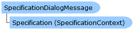

       

 Collapse All Expand All  Language Filter: All  Language Filter: Multiple  Language Filter: Visual Basic (Declaration) Language Filter: Visual Basic (Usage) Language Filter: C#  
---  
DriveWorks SDK Documentation  |   
---|---  
SpecificationDialogMessage Class   
[Members](topic5335.md) See Also [Send Feedback](mailto:apisupport@driveworks.co.uk?subject=Documentation Feedback: topic5334.md)  
[DriveWorks.Engine Assembly](topic2156.md) > [DriveWorks Namespace](topic2159.md) : SpecificationDialogMessage Class  
---  
  
Visual Basic (Declaration)    
Visual Basic (Usage)    
C# 

Glossary Item Box

Provides information about specification specific dialog messages. 

# Object Model

# Syntax

Visual Basic (Declaration)|   
---|---  
      
    
    Public Class SpecificationDialogMessage 
       Inherits [DialogUserMessage](topic2705.md)  
  
Visual Basic (Usage)| Copy Code  
---|---  
      
    
    Dim instance As [SpecificationDialogMessage](topic5334.md)  
  
C#|   
---|---  
      
    
    public class SpecificationDialogMessage : [DialogUserMessage](topic2705.md)   
  
# Inheritance Hierarchy

System.Object  
[DriveWorks.UserMessage](topic5821.md)  
[DriveWorks.DialogUserMessage](topic2705.md)  
**DriveWorks.SpecificationDialogMessage**  

# Requirements

**Target Platforms:** Please see DriveWorks software prerequisites.

# See Also

#### Reference

[SpecificationDialogMessage Members](topic5335.md)   
[DriveWorks Namespace](topic2159.md)

©2024 DriveWorks Ltd. All Rights Reserved.
