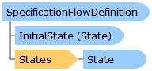

SpecificationFlowDefinition Class   
[Members](topic11388.md)   
[DriveWorks.Engine Assembly](topic2156.md) > [DriveWorks.Specification Namespace](topic10764.md) : SpecificationFlowDefinition Class  
---  
  
Visual Basic (Declaration)    
Visual Basic (Usage)    
C# 

Glossary Item Box

Supports working with a customized specification-flow definition on a project. 

# Object Model

# Syntax

Visual Basic (Declaration)|   
---|---  
      
    
    Public NotInheritable Class SpecificationFlowDefinition 
       Inherits DriveWorks.DomainObject
       Implements [DriveWorks.Abstractions.ICustomizable](topic5941.md)   
  
Visual Basic (Usage)| Copy Code  
---|---  
      
    
    Dim instance As [SpecificationFlowDefinition](topic11387.md)  
  
C#|   
---|---  
      
    
    public sealed class SpecificationFlowDefinition : DriveWorks.DomainObject, [DriveWorks.Abstractions.ICustomizable](topic5941.md)    
  
# Remarks

For more information about specification flow, consult the specification-flow topic in the user and API documentation.

Technically it is possible through the API to modify the specification-flow definition for a specification, however this is not recommended and is not supported.

# Inheritance Hierarchy

System.Object  
System.MarshalByRefObject  
**DriveWorks.Specification.SpecificationFlowDefinition**  

# Requirements

**Target Platforms:** Please see DriveWorks software prerequisites.

# See Also

#### Reference

[SpecificationFlowDefinition Members](topic11388.md)   
[DriveWorks.Specification Namespace](topic10764.md)

