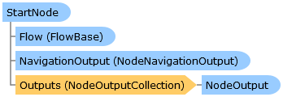

StartNode Class   
[Members](topic7121.md)   
[DriveWorks.Engine Assembly](topic2156.md) > [DriveWorks.EventFlow Namespace](topic6871.md) : StartNode Class  
---  
  
Visual Basic (Declaration)    
Visual Basic (Usage)    
C# 

Glossary Item Box

Represents the very first node in a [FlowBase](topic6999.md) where execution will begin. 

# Object Model

# Syntax

Visual Basic (Declaration)|   
---|---  
      
    
    Public Class StartNode 
       Implements [IFlowNode](topic6873.md)   
  
Visual Basic (Usage)| Copy Code  
---|---  
      
    
    Dim instance As [StartNode](topic7120.md)  
  
C#|   
---|---  
      
    
    public class StartNode : [IFlowNode](topic6873.md)    
  
# Inheritance Hierarchy

System.Object  
**DriveWorks.EventFlow.StartNode**  
[DriveWorks.EventFlow.MacroStartNode](topic7050.md)  

# Requirements

**Target Platforms:** Please see DriveWorks software prerequisites.

# See Also

#### Reference

[StartNode Members](topic7121.md)   
[DriveWorks.EventFlow Namespace](topic6871.md)

