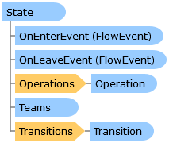

       

 Collapse All Expand All  Language Filter: All  Language Filter: Multiple  Language Filter: Visual Basic (Declaration) Language Filter: Visual Basic (Usage) Language Filter: C#  
---  
DriveWorks SDK Documentation  |   
---|---  
State Class   
[Members](topic11560.md)   
[DriveWorks.Engine Assembly](topic2156.md) > [DriveWorks.Specification Namespace](topic10764.md) : State Class  
---  
  
Visual Basic (Declaration)    
Visual Basic (Usage)    
C# 

Glossary Item Box

Provides a means for working with the definition of a specific state in a specification-flow. 

# Object Model

# Syntax

Visual Basic (Declaration)|   
---|---  
      
    
    <DebuggerDisplayAttribute(Value="{Title}: {Id.ToString("B")}", 
       Name="", 
       Type="", 
       Target=, 
       TargetTypeName="")>
    Public NotInheritable Class State 
       Inherits DriveWorks.DomainObject  
  
Visual Basic (Usage)| Copy Code  
---|---  
      
    
    Dim instance As [State](topic11559.md)  
  
C#|   
---|---  
      
    
    [DebuggerDisplayAttribute(Value="{Title}: {Id.ToString("B")}", 
       Name="", 
       Type="", 
       Target=, 
       TargetTypeName="")]
    public sealed class State : DriveWorks.DomainObject   
  
# Inheritance Hierarchy

System.Object  
System.MarshalByRefObject  
**DriveWorks.Specification.State**  

# Requirements

**Target Platforms:** Please see DriveWorks software prerequisites.

# See Also

#### Reference

[State Members](topic11560.md)   
[DriveWorks.Specification Namespace](topic10764.md)

