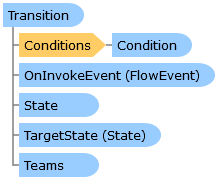

Transition Class   
[Members](topic11758.md)   
[DriveWorks.Engine Assembly](topic2156.md) > [DriveWorks.Specification Namespace](topic10764.md) : Transition Class  
---  
  
Visual Basic (Declaration)    
Visual Basic (Usage)    
C# 

Glossary Item Box

Represents a transition from one state to another. 

# Object Model

# Syntax

Visual Basic (Declaration)|   
---|---  
      
    
    <DebuggerDisplayAttribute(Value="{Name}: {State.Title}->{TargetState.Title}", 
       Name="", 
       Type="", 
       Target=, 
       TargetTypeName="")>
    Public NotInheritable Class Transition 
       Inherits DriveWorks.DomainObject  
  
Visual Basic (Usage)| Copy Code  
---|---  
      
    
    Dim instance As [Transition](topic11757.md)  
  
C#|   
---|---  
      
    
    [DebuggerDisplayAttribute(Value="{Name}: {State.Title}->{TargetState.Title}", 
       Name="", 
       Type="", 
       Target=, 
       TargetTypeName="")]
    public sealed class Transition : DriveWorks.DomainObject   
  
# Inheritance Hierarchy

System.Object  
System.MarshalByRefObject  
**DriveWorks.Specification.Transition**  

# Requirements

**Target Platforms:** Please see DriveWorks software prerequisites.

# See Also

#### Reference

[Transition Members](topic11758.md)   
[DriveWorks.Specification Namespace](topic10764.md)

