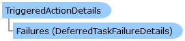

       

 Collapse All Expand All  Language Filter: All  Language Filter: Multiple  Language Filter: Visual Basic (Declaration) Language Filter: Visual Basic (Usage) Language Filter: C#  
---  
DriveWorks SDK Documentation  |   
---|---  
TriggeredActionDetails Class   
[Members](topic5725.md)   
[DriveWorks.Engine Assembly](topic2156.md) > [DriveWorks Namespace](topic2159.md) : TriggeredActionDetails Class  
---  
  
Visual Basic (Declaration)    
Visual Basic (Usage)    
C# 

Glossary Item Box

Provides support for exposing information about a released [TriggeredAction](topic5708.md). 

# Object Model

# Syntax

Visual Basic (Declaration)|   
---|---  
      
    
    Public Class TriggeredActionDetails   
  
Visual Basic (Usage)| Copy Code  
---|---  
      
    
    Dim instance As [TriggeredActionDetails](topic5724.md)  
  
C#|   
---|---  
      
    
    public class TriggeredActionDetails   
  
# Inheritance Hierarchy

System.Object  
**DriveWorks.TriggeredActionDetails**  

# Requirements

**Target Platforms:** Please see DriveWorks software prerequisites.

# See Also

#### Reference

[TriggeredActionDetails Members](topic5725.md)   
[DriveWorks Namespace](topic2159.md)

