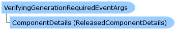

       

 Collapse All Expand All  Language Filter: All  Language Filter: Multiple  Language Filter: Visual Basic (Declaration) Language Filter: Visual Basic (Usage) Language Filter: C#  
---  
DriveWorks SDK Documentation  |   
---|---  
VerifyingGenerationRequiredEventArgs Class   
[Members](topic13918.md)   
[DriveWorks.SolidWorks Assembly](topic13342.md) > [DriveWorks.SolidWorks Namespace](topic13345.md) : VerifyingGenerationRequiredEventArgs Class  
---  
  
Visual Basic (Declaration)    
Visual Basic (Usage)    
C# 

Glossary Item Box

Represents the event data for the VerifyingGenerationRequired event. 

# Object Model

# Syntax

Visual Basic (Declaration)|   
---|---  
      
    
    Public NotInheritable Class VerifyingGenerationRequiredEventArgs 
       Inherits System.EventArgs  
  
Visual Basic (Usage)| Copy Code  
---|---  
      
    
    Dim instance As [VerifyingGenerationRequiredEventArgs](topic13917.md)  
  
C#|   
---|---  
      
    
    public sealed class VerifyingGenerationRequiredEventArgs : System.EventArgs   
  
# Inheritance Hierarchy

System.Object  
System.EventArgs  
**DriveWorks.SolidWorks.VerifyingGenerationRequiredEventArgs**  

# Requirements

**Target Platforms:** Please see DriveWorks software prerequisites.

# See Also

#### Reference

[VerifyingGenerationRequiredEventArgs Members](topic13918.md)   
[DriveWorks.SolidWorks Namespace](topic13345.md)

