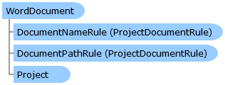

WordDocument Class   
[Members](topic5886.md)   
[DriveWorks.Engine Assembly](topic2156.md) > [DriveWorks Namespace](topic2159.md) : WordDocument Class  
---  
  
Visual Basic (Declaration)    
Visual Basic (Usage)    
C# 

Glossary Item Box

Provides the capability to work with Microsoft Word documents. 

# Object Model

# Syntax

Visual Basic (Declaration)|   
---|---  
      
    
    Public Class WordDocument 
       Inherits [FileDocumentBase](topic2870.md)
       Implements [DriveWorks.Extensibility.IExtension](topic7152.md)   
  
Visual Basic (Usage)| Copy Code  
---|---  
      
    
    Dim instance As [WordDocument](topic5885.md)  
  
C#|   
---|---  
      
    
    public class WordDocument : [FileDocumentBase](topic2870.md), [DriveWorks.Extensibility.IExtension](topic7152.md)    
  
# Inheritance Hierarchy

System.Object  
System.MarshalByRefObject  
[DriveWorks.ProjectDocument](topic4356.md)  
[DriveWorks.FileDocumentBase](topic2870.md)  
**DriveWorks.WordDocument**  

# Requirements

**Target Platforms:** Please see DriveWorks software prerequisites.

# See Also

#### Reference

[WordDocument Members](topic5886.md)   
[DriveWorks Namespace](topic2159.md)

